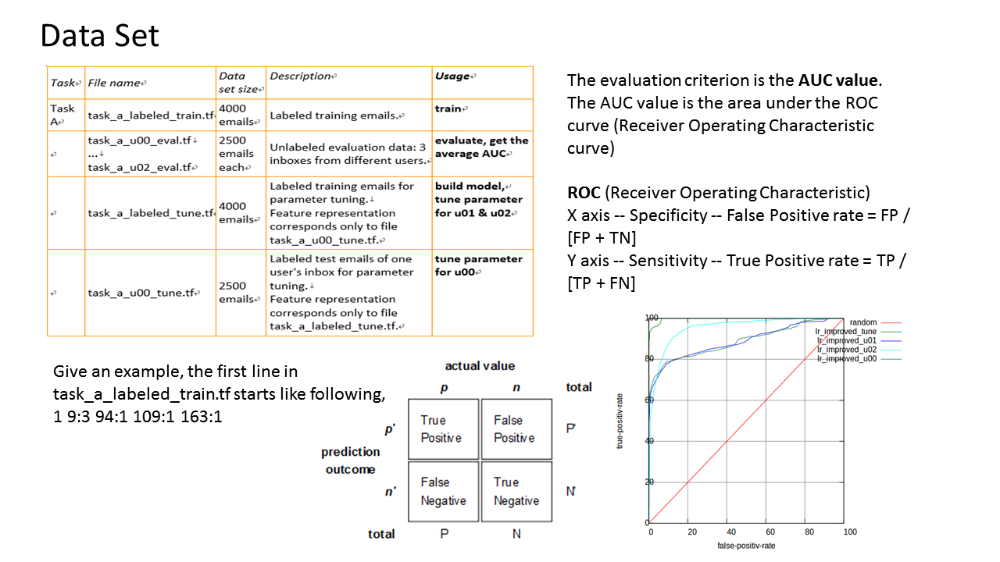
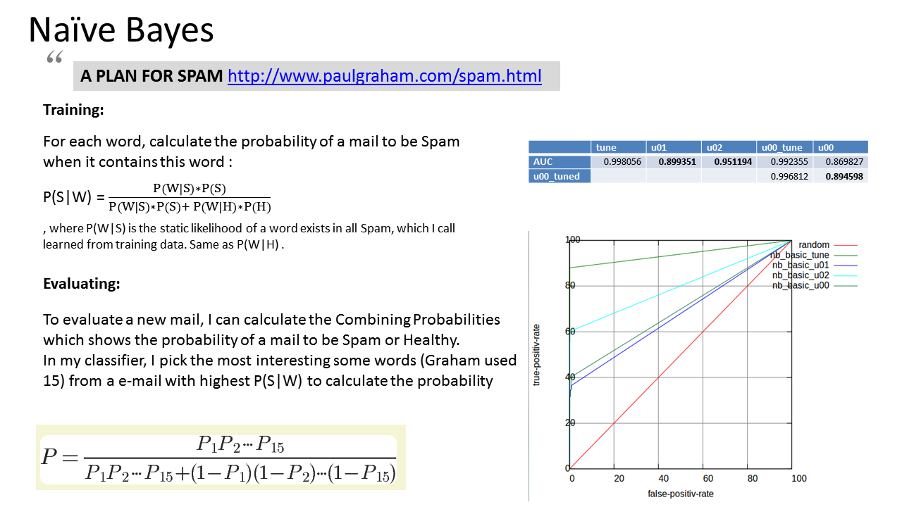
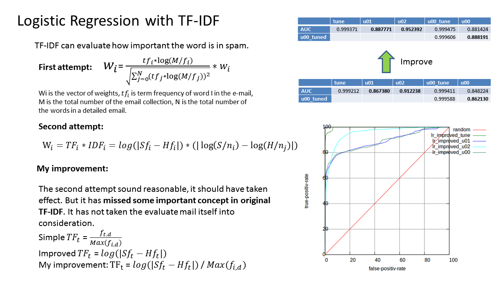
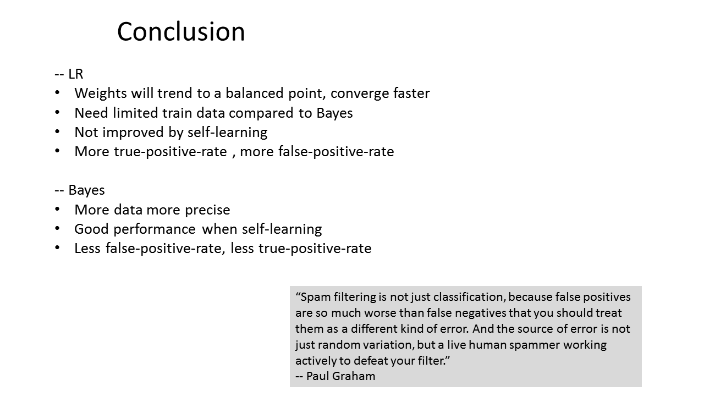

<header class="caption">
  <h1>Email Spam Filter</h1>
  
Renjie Weng &lt;rweng@stevens.edu&gt;

</header>
<section class="slide shout" id="1">

  

</section>
<section class="slide shout" id="2">

  

</section>
<section class="slide shout" id="3">

  

</section>
<section class="slide shout" id="4">

  

</section>
<section class="slide shout" id="5">

  

</section>
<section class="slide shout" id="6">

  

</section>
<section class="slide shout" id="7">

  

</section>
<section class="slide shout" id="8">

  

</section>
<section class="slide shout" id="9">

  

</section>
<section class="slide shout" id="10">

  

</section>

<section class="slide" id="SeeMore">

  <h2><a href="https://github.com/shohoku11wrj/Spam-Filter">See details on GitHub</a></h2>
  
This slideshow is powered by <a href="https://github.com/shower/shwr.me">Shower</a>

  <h3>Back to <a href="http://www.rangerway.com/slides">http://rangerway.com/slides</a></h3>
  

</section>